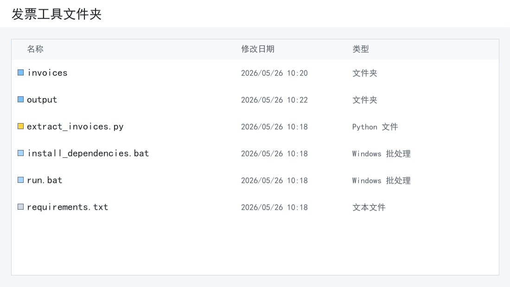
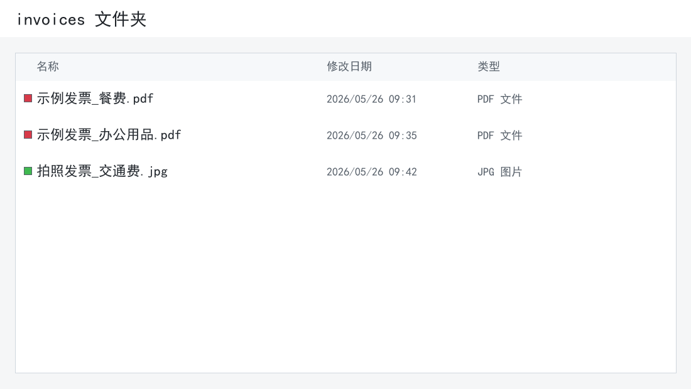
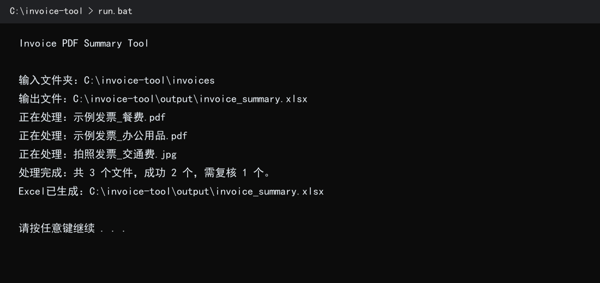
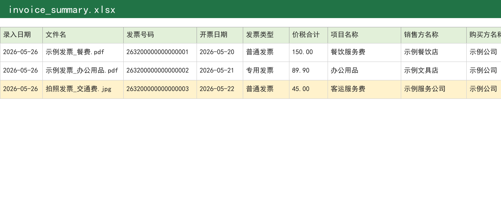

# 电子发票汇总工具

这是一个给报销发票做汇总的小工具。

平时把发票 PDF 或图片放进 `invoices` 文件夹，运行程序后，会在 `output` 文件夹里生成 `invoice_summary.xlsx`。表格里会整理出发票号码、开票日期、金额、税额、价税合计、项目名称、销售方、购买方等信息。



## 能识别哪些文件

目前主要按下面几类处理：

- 税务平台下载的标准电子发票 PDF。
- 扫描件或图片型 PDF。
- 手机拍照的发票图片。
- 常见图片格式：JPG、JPEG、PNG、BMP、TIF、TIFF。

标准电子发票会优先直接读取 PDF 里的文字。图片、扫描件、拍照件会走 OCR，结果能用，但最好再人工看一遍。

## 第一次使用

先确认电脑里有 Python。建议装 Python 3.11 或更新版本。

如果没有装，可以到 Python 官网下载安装。安装时注意勾选 `Add python.exe to PATH`，否则双击脚本时可能找不到 Python。

下载好本项目后，文件夹里应该能看到这些文件：

- `install_dependencies.bat`
- `run.bat`
- `extract_invoices.py`
- `requirements.txt`
- `invoices`
- `output`

如果下载后没有看到 `invoices` 或 `output`，手动新建这两个文件夹也可以。

第一次使用时，双击 `install_dependencies.bat`。它会安装 PDF 读取、Excel 写入和 OCR 识别需要的依赖。这个步骤一般只需要做一次。

## 日常怎么用

第一步，把要处理的发票放进 `invoices` 文件夹。



第二步，回到工具主文件夹，双击 `run.bat`。

运行时会出现一个黑色窗口，能看到程序正在处理哪些文件。窗口最后会提示 Excel 已经生成。



第三步，打开 `output` 文件夹，查看 `invoice_summary.xlsx`。



如果 `invoice_summary.xlsx` 正在被 Excel 打开，程序不会强行覆盖它，会另外生成一个带时间的文件，例如 `invoice_summary_20260526_103012.xlsx`。

## 表格里有哪些列

生成的 Excel 目前包含这些列：

录入日期、文件名、发票号码、开票日期、发票类型、金额、税额、价税合计、项目名称、销售方名称、销售方纳税人识别号、购买方名称、购买方纳税人识别号、处理状态、备注。

其中：

- `录入日期` 按文件在本机的创建日期填写。
- 重复的发票号码会标黄。
- OCR 识别出来的记录，会在备注里写上“人工复核”的提示。
- 没识别出来的字段会留空，备注里会写缺了哪些字段。

## 通过 pip 安装

如果不想下载整个文件夹，也可以直接从 GitHub 安装：

```powershell
py -3 -m pip install git+https://github.com/yong73529-hue/yong-invoice-tool.git
```

安装后，进入你准备存放发票的目录，运行：

```powershell
mkdir invoices
py -3 -m extract_invoices
```

程序会读取当前目录下的 `invoices` 文件夹，并把结果写到当前目录下的 `output` 文件夹。

如果想固定读取某个目录，可以这样写：

```powershell
$env:YONG_INVOICE_BASE_DIR = "D:\project2"
py -3 -m extract_invoices
```

## 常见问题

**双击后提示找不到 Python**

重新安装 Python，并勾选 `Add python.exe to PATH`。装好后重新打开工具文件夹再试。

**提示缺少依赖**

双击 `install_dependencies.bat`。如果安装中断，检查网络后再运行一次。

**图片发票识别不准**

拍照尽量正一些，发票边框和文字不要被遮挡。OCR 的结果本来就会有误差，Excel 里标了需要复核的行，建议人工确认。

**有些字段是空的**

不同平台的发票版式不完全一样。字段为空时，先看备注列；如果经常遇到同一种发票识别不出来，再补解析规则。

## 修改识别规则

后面如果要改识别规则，可以先看 `AGENTS.md`。里面记录了字段顺序、排查命令和提交前检查项。
